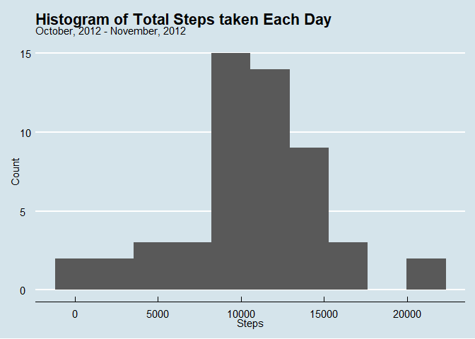
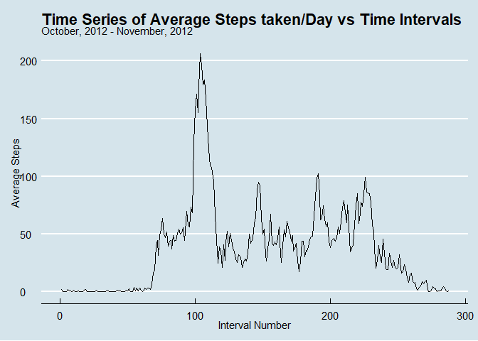
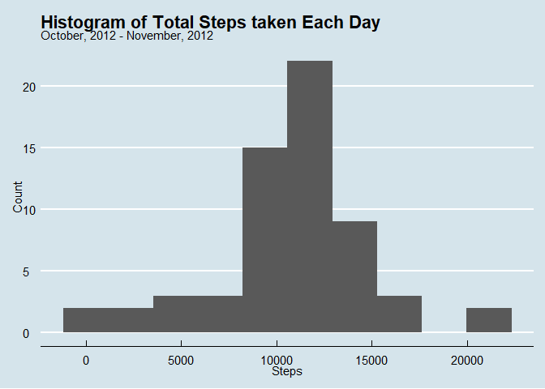
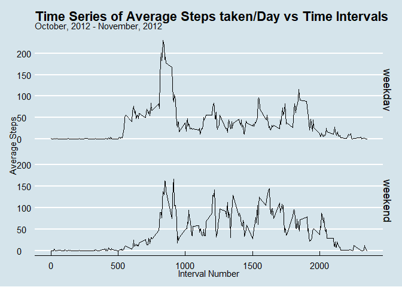

## 1. Loading and preprocessing the data  


```r
# checking if data file exists
if(!file.exists("activity.zip")) {
        library(zip)
        temp <- tempfile()
        fileurl <- "https://d396qusza40orc.cloudfront.net/repdata%2Fdata%2Factivity.zip"
        download.file(fileurl, temp)
        unzip(temp)
}

# once the file is downloaded, we can load the data
act <- read.csv("activity.csv")
act$date <- as.Date(act$date)
head(act)
```

```
##   steps       date interval
## 1    NA 2012-10-01        0
## 2    NA 2012-10-01        5
## 3    NA 2012-10-01       10
## 4    NA 2012-10-01       15
## 5    NA 2012-10-01       20
## 6    NA 2012-10-01       25
```


## 2. What is mean total number of steps taken per day?
*For this part of the assignment, you can ignore the missing values in the dataset.*  

Requirements:  
1. Calculate the total number of steps taken per day  
2. If you do not understand the difference between a histogram and a barplot, research the difference between them. Make a histogram of the total number of steps taken each day  
3. Calculate and report the mean and median of the total number of steps taken per day

### 2.1 Calculate the total number of steps taken per day  


```r
library(dplyr)
```

```
## 
## Attaching package: 'dplyr'
```

```
## The following objects are masked from 'package:stats':
## 
##     filter, lag
```

```
## The following objects are masked from 'package:base':
## 
##     intersect, setdiff, setequal, union
```

```r
steps <- act %>% group_by(date) %>% summarize(Total_Steps = sum(steps))
```

```
## `summarise()` ungrouping output (override with `.groups` argument)
```

```r
steps <- data.frame(steps)
```

### 2.2 Make a histogram of the total number of steps taken each day  


```r
library(ggplot2)
library(ggthemes)
```

```
## Warning: package 'ggthemes' was built under R version 4.0.3
```

```r
ggplot(steps, aes(Total_Steps)) +
        geom_histogram(bins = 10) +
        labs(title = "Histogram of Total Steps taken Each Day", 
             subtitle = "October, 2012 - November, 2012") + 
        xlab("Steps") + 
        ylab("Count") + 
        theme_economist()
```

```
## Warning: Removed 8 rows containing non-finite values (stat_bin).
```




### 2.3 Calculate and report mean and median of total number of steps taken per day

**Mean**  


```r
meanSteps <- mean(steps$Total_Steps, na.rm = TRUE)
meanSteps <- format(meanSteps,  scientific = FALSE)
cat(meanSteps)
```

```
## 10766.19
```
So, the mean of the total steps taken each day is 10766.19.  

**Median**  


```r
medianSteps <- median(steps$Total_Steps, na.rm = TRUE)
print(medianSteps)
```

```
## [1] 10765
```
So, the mean of the total steps taken each day is 10765.  

## 3. What is the average daily activity pattern?  

Requirements:  
1. Make a time series plot (i.e. type = "l") of the 5-minute interval (x-axis) and the average number of steps taken, averaged across all days (y-axis)  
2. Which 5-minute interval, on average across all the days in the dataset, contains the maximum number of steps?  

### 3.1 Make a time series plot of the 5-minute interval and the average number of steps taken, averaged across all days.


```r
avgSteps <- act %>% group_by(interval) %>% summarize(avg_Steps = mean(steps, na.rm = TRUE))
```

```
## `summarise()` ungrouping output (override with `.groups` argument)
```

```r
avgSteps$interval_number <- 1:nrow(avgSteps)

ggplot(avgSteps, aes(interval_number, avg_Steps)) +
        geom_line() +
        labs(title = "Time Series of Average Steps taken/Day vs Time Intervals", 
             subtitle = "October, 2012 - November, 2012") + 
        xlab("Interval Number") + 
        ylab("Average Steps") + 
        theme_economist()
```



### 3.2 Which 5-minute interval, on average across all the days in the dataset, contains the maximum number of steps?  


```r
maxSteps <- avgSteps$interval_number[which.max(avgSteps$avg_Steps)]
maxStepsInterval <- paste(avgSteps$interval[maxSteps-1], 
                          avgSteps$interval[maxSteps],
                          sep=" - ")
paste(maxSteps, maxStepsInterval, sep=" : ")
```

```
## [1] "104 : 830 - 835"
```
So, the maximum number of average steps occur in the interval   830 - 835.  

## 4. Imputing missing values

*Note that there are a number of days/intervals where there are missing values (coded as NA). The presence of missing days may introduce bias into some calculations or summaries of the data.*

Requirements:  
1. Calculate and report the total number of missing values in the dataset (i.e. the total number of rows with NAs)  
2. Devise a strategy for filling in all of the missing values in the dataset. The strategy does not need to be sophisticated. For example, you could use the mean/median for that day, or the mean for that 5-minute interval, etc.  
3. Create a new dataset that is equal to the original dataset but with the missing data filled in.  
4. Make a histogram of the total number of steps taken each day and Calculate and report the mean and median total number of steps taken per day. Do these values differ from the estimates from the first part of the assignment? What is the impact of imputing missing data on the estimates of the total daily number of steps?  

### 4.1 Calculate and report the total number of missing values in the dataset (i.e. the total number of rows with NAs)  


```r
act_NAs <- nrow(act[is.na(act),])
print(act_NAs)
```

```
## [1] 2304
```
So, the total number of rows with NAs is 2304.  

### 4.2 Devise a strategy for filling in all of the missing values in the dataset. The strategy does not need to be sophisticated. For example, you could use the mean/median for that day, or the mean for that 5-minute interval, etc.  

Here, I'm going to use the average steps taken each day according to 5 minute interval to fill in the places of NAs.  
1. First, I'm going to copy the current dataset with a new name.  
2. Then I'm going to run a for loop which will loop through each of the steps in the "steps" column of dataset.  
3. If that particular step value is an NA, then its going to replace it with avg steps value taken from the interval averaged value as calculated previously.  

### 4.3 Create a new dataset that is equal to the original dataset but with the missing data filled in.  


```r
# making a copy of current dataset
act_NAsremoved <- act

# checking the number of NAs in this dataset
numNAs_b4 <- sum(is.na(act_NAsremoved$steps))
paste("The number of NAs in 'steps' column before implementing strategy is", 
      numNAs_b4, sep = ": ")
```

```
## [1] "The number of NAs in 'steps' column before implementing strategy is: 2304"
```

```r
# implementing strategy
for (i in seq_along(act_NAsremoved$steps)) {
        if (is.na(act_NAsremoved$steps[i])) {
                act_NAsremoved$steps[i] <- avgSteps$avg_Steps[which(avgSteps$interval == act_NAsremoved$interval[i])]
        }
}

# checking the NAs again
numNAs_aft <- sum(is.na(act_NAsremoved$steps))
paste("The number of NAs in 'steps' column after implementing strategy is", 
      numNAs_aft, sep = ": ")
```

```
## [1] "The number of NAs in 'steps' column after implementing strategy is: 0"
```


### 4.4  Make a histogram of the total number of steps taken each day and Calculate and report the mean and median total number of steps taken per day. Do these values differ from the estimates from the first part of the assignment? What is the impact of imputing missing data on the estimates of the total daily number of steps?  

Calculating total steps taken each day  

```r
stepsNew <- act_NAsremoved %>% group_by(date) %>% 
        summarize(total_steps = sum(steps))
```

```
## `summarise()` ungrouping output (override with `.groups` argument)
```

Making histogram  

```r
ggplot(stepsNew, aes(total_steps)) +
        geom_histogram(bins = 10) +
        labs(title = "Histogram of Total Steps taken Each Day", 
             subtitle = "October, 2012 - November, 2012") + 
        xlab("Steps") + 
        ylab("Count") + 
        theme_economist()
```



Calculating new mean  

```r
meanStepsNew <- mean(stepsNew$total_steps)
meanStepsNew <- format(meanStepsNew,  scientific = FALSE)
paste("The new mean is", meanStepsNew, sep = ": ")
```

```
## [1] "The new mean is: 10766.19"
```

Calculating new median  

```r
medianStepsNew <- median(stepsNew$total_steps)
medianStepsNew <- format(medianStepsNew,  scientific = FALSE)
paste("The new median is", medianStepsNew, sep = ": ")
```

```
## [1] "The new median is: 10766.19"
```
#### Difference  
The values of mean and median before replacing NAs were 10766.19 and 10765 respectively. After replacing NA values, they changed to 10766.19 and 10766.19. The mean value remained same while the median value changed very little about 0.01%.  
The histogram however shows less skewness compared to original data.  


## 5. Are there differences in activity patterns between weekdays and weekends?  
*For this part the weekdays() function may be of some help here. Use the dataset with the filled-in missing values for this part.*  

Requirements:  
1. Create a new factor variable in the dataset with two levels – “weekday” and “weekend” indicating whether a given date is a weekday or weekend day.  
2. Make a panel plot containing a time series plot (i.e. type = "l") of the 5-minute interval (x-axis) and the average number of steps taken, averaged across all weekday days or weekend days (y-axis). See the README file in the GitHub repository to see an example of what this plot should look like using simulated data.  

### 5.1 Create a new factor variable in the dataset with two levels – “weekday” and “weekend” indicating whether a given date is a weekday or weekend day.  

```r
act_NAsremoved$weekday <- 0
for (i in seq_along(act_NAsremoved$date)) {
  if (weekdays(act_NAsremoved$date[i]) == "Sunday" | weekdays(act_NAsremoved$date[i]) == "Saturday") {
    act_NAsremoved$weekday[i] <- "weekend"
  } else {
    act_NAsremoved$weekday[i] <- "weekday"
  }
}
```

### 5.2 Make a panel plot containing a time series plot (i.e. type = "l") of the 5-minute interval (x-axis) and the average number of steps taken, averaged across all weekday days or weekend days (y-axis).    


```r
act2 <- act_NAsremoved
act2$cat <- interaction(act2$weekday, act2$interval)
act2 <- aggregate(act2$steps, list(act2$cat), mean)
act2$weekday <- sapply(act2$Group.1, function(x) {
  y <- strsplit(as.character(x), "\\.")
  return(y[[1]][1])
})
act2$interval <- sapply(act2$Group.1, function(x) {
  y <- strsplit(as.character(x), "\\.")
  return(y[[1]][2])
})
act2$Group.1 <- NULL
names(act2)[1] <- "steps"
act2$interval <- as.integer(act2$interval)

ggplot(act2, aes(interval, steps)) +
  geom_line() + facet_grid(weekday~.) +
  labs(title = "Time Series of Average Steps taken/Day vs Time Intervals", 
       subtitle = "October, 2012 - November, 2012") + 
  xlab("Interval Number") + 
  ylab("Average Steps") + 
  theme_economist()
```



<center> The End </center>
